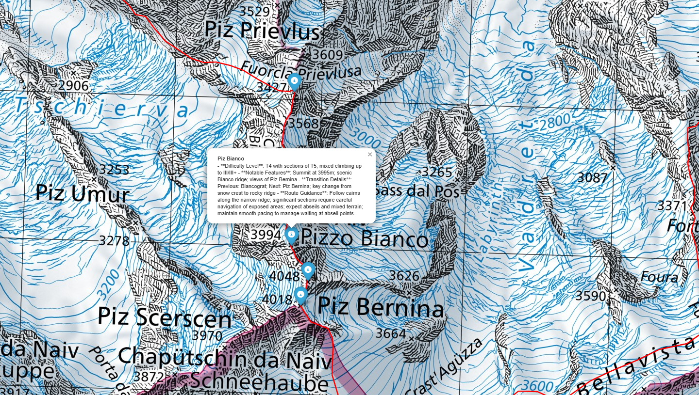

# TrailGPT: A GeoAI Framework for Alpine Route Understanding

> **AI-driven geoinformation retrieval and visualization for mountaineering.**  
> Combining web scraping, NLP summarization, and GIS tools to transform user-generated reports into climber-centric map insights.


##  Overview

TrailGPT is a research project developed at the **University of Zurich (Department of Geography)** that integrates **web scraping**, **AI-driven text summarization**, and **GIS-based visualization** to retrieve and represent geoinformation for mountaineering.  

By leveraging publicly available tour reports from platforms such as **Hikr**, the workflow extracts place names, geocodes them along mountain routes, and generates concise, climber-focused insights using **OpenAI models**.  
The system demonstrates how **GeoAI** can enhance route planning, safety assessment, and accessibility of geographic knowledge in alpine environments.

##  Interactive Map Preview

Below you can explore a **sample route visualization** (*Piz Bernina tour*).  
The figure shows the AI-generated route description overlaid on the SwissTopo map.



>  For the fully interactive version, open it locally or via GitHub Pages:  
> [**Open Interactive Map →**](results/route_with_descriptions_map.html)

##  Research Objectives

1. **Gathering and Filtering Data**  
   How can publicly available descriptive text data be effectively gathered, filtered, and structured to generate geoinformation that supports mountaineering tasks — with attention to ethics and transparency?

2. **Cartography and Safety**  
   In what ways can cartographic design and geospatial visualization enhance the safety of individuals exposed to risks such as mountaineers — and what responsibilities come with map creation?

3. **AI and GIS for Mountaineering**  
   How can the integration of AI-based summarization and GIS visualization improve accessibility and usability of geospatial information for climbers?

---

##  Methodology

The TrailGPT workflow consists of five stages:

| Step | Description |
|------|--------------|
| **1. Web Scraping** | Extracts tour reports from [Hikr.org](https://www.hikr.org/) using `requests` and `BeautifulSoup`. |
| **2. Text Parsing** | Identifies peaks, huts, and valleys via `spaCy` NER (German model). |
| **3. Geoparsing** | Matches place names to GPX routes using `geopy` and geodesic filtering. |
| **4. AI Summarization** | Uses the OpenAI API to generate concise mountaineering summaries with difficulty, transitions, and navigation hints. |
| **5. GIS Visualization** | Displays results on SwissTopo maps via `folium` with route overlays and annotated waypoints. |

---

##  Repository Structure

```

TrailGPT/
│
├── data/                # Raw and processed datasets (CSV, GPX)
├── notebooks/           # Jupyter notebooks (scraping, analysis, visualization)
├── results/             # Output maps and summarized route data
├── src/                 # Python scripts (scraping, NER, summarization, mapping)
├── docs/                # Paper, presentation, and references
│   ├── Retrieving_Geoinformation_2024.pdf
│   └── Lightning_Presentation.pptx
│
├── README.md
├── requirements.txt
└── .gitignore

```

---

## Example Output

**Case Studies:**  
- 🏔 **Piz Bernina** — 190 reports processed, 43 geoparsed locations  
- 🏔 **Bishorn** — 78 reports processed, 38 geoparsed locations  

**Generated Results:**  
- AI-generated place summaries with mountaineering scales (e.g., T4, PD)  
- Interactive SwissTopo maps with annotated key decision points  
- Context-aware visualizations integrating spatial and textual data  

---

## Ethical and Practical Considerations

- Web scraping follows the ethical guidelines of [Brown et al., 2024](https://doi.org/10.48550/arXiv.2410.23432).  
- All data are publicly accessible and used for academic research only.  
- AI-generated descriptions may contain inaccuracies and should **not** be used for navigation or safety-critical purposes without expert validation.

---

## Technologies Used

- **Python 3.11+**
- `requests`, `BeautifulSoup4`, `spaCy`, `geopy`, `folium`, `pandas`
- **OpenAI GPT API** for text summarization  
- **SwissTopo base maps** for visualization


